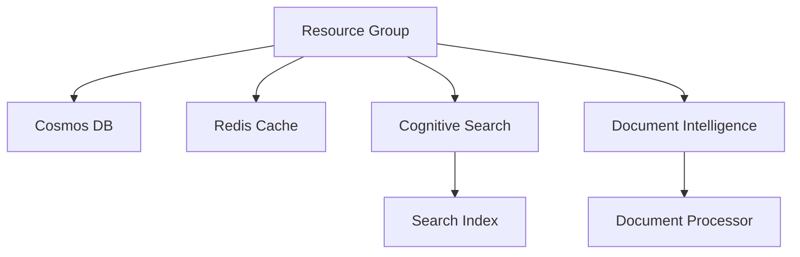

# Konveyor RAG Implementation Status

## Overview
Konveyor implements Retrieval-Augmented Generation (RAG) using Azure services to provide intelligent responses for software engineering documentation, focusing on Large and Organizational codebases.

## Architecture Decisions

### 1. Storage Layer Architecture

#### Cosmos DB Design (Long-term Storage)
- **Choice of MongoDB API**
  - Flexible schema for evolving conversation structures
  - Native support for nested documents (messages within conversations)
  - Rich querying capabilities for analytics
  - Better developer experience with familiar MongoDB syntax

- **Serverless Architecture**
  - Auto-scaling from 0 to 1000 RU/s based on demand
  - Ideal for sporadic usage patterns in hackathon
  - No minimum cost during idle periods
  - Prevents over-provisioning of resources

- **Collection Schema**
  ```json
  conversations: {
    "_id": "<uuid>",
    "user_id": "<user_id>",
    "created_at": "<timestamp>",
    "metadata": {
      "title": "string",
      "tags": ["array"],
      "source_context": "string"
    }
  }

  messages: {
    "_id": "<uuid>",
    "conversation_id": "<conversation_id>",
    "role": "user|assistant",
    "content": "string",
    "created_at": "<timestamp>",
    "context_used": [{
      "source": "string",
      "content": "string",
      "score": "float"
    }]
  }
  ```

- **Optimization Decisions**
  - Eventual consistency: Acceptable for chat history
  - Combined indexes: Reduce storage and improve query performance
  - 48-hour backup retention: Sufficient for hackathon demo
  - Daily backups: Balance between safety and cost

#### Redis Cache Strategy
- **Purpose & Benefits**
  - Caches active conversation context
  - Reduces Cosmos DB reads for recent messages
  - Improves response time for ongoing conversations
  - Minimizes costs by reducing database operations

- **Cache Design**
  ```
  KEY: conv:<conversation_id>
  VALUE: {
    last_messages: [recent messages],
    context: [relevant context],
    metadata: {user preferences}
  }
  TTL: 1 hour of inactivity
  ```

- **Optimization Choices**
  - Basic SKU: Sufficient for demo workload
  - 0 capacity: Smallest available size
  - LRU eviction: Automatically manage memory
  - SSL-only: Security best practice

### 2. Search & Retrieval Architecture

#### Hybrid Search Implementation
- **Vector Search Configuration**
  ```json
  {
    "vector_fields": {
      "content_vector": {
        "dimension": 1536,
        "similarity": "cosine"
      }
    },
    "semantic_config": {
      "configurations": [{
        "name": "default",
        "prioritized_fields": {
          "titleField": "title",
          "contentFields": ["content"]
        }
      }]
    }
  }
  ```

- **Search Orchestration**
  1. Generate embeddings for query
  2. Perform vector similarity search
  3. Apply keyword boosting
  4. Combine and rank results
  5. Filter by relevance threshold

### 3. Service Integration Architecture

#### Document Processing Pipeline
```
Document Upload → Document Intelligence → Text Extraction → 
Chunk Generation → Vector Embedding → Search Indexing
```

#### Data Flow Architecture
```
User Query → RAG Service → Context Service → Search Service
                                         → Document Service
           → Storage Manager → Cosmos DB
                            → Redis Cache
```

#### Key Integration Points
1. **Document Service → Context Service**
   - Chunk size: 1000 tokens
   - Overlap: 100 tokens
   - Metadata preservation
   - Source tracking

2. **Search Service → Context Service**
   - Hybrid ranking algorithm
   - Configurable relevance thresholds
   - Source diversity optimization
   - Result deduplication

3. **Storage Manager → RAG Service**
   - Write-through caching
   - Batch operations for efficiency
   - Automatic cache invalidation
   - Error resilience

### 4. RAG Components

#### Context Service
```python
class ContextService:
    - retrieve_context(): Fetches relevant documentation
    - hybrid_search(): Combines vector and keyword search
    - process_documents(): Handles document ingestion
```

#### RAG Service
```python
class RAGService:
    - generate_response(): Creates contextual responses
    - manage_conversation(): Handles conversation flow
    - format_prompts(): Uses templates for different queries
```

## Infrastructure Integration

### 1. Infrastructure as Code Architecture

#### Module Organization
```
konveyor-infra/
├── main.tf           # Main configuration
├── variables.tf      # Input variables
└── modules/
    ├── rag/         # RAG infrastructure
    │   ├── main.tf
    │   ├── variables.tf
    │   └── outputs.tf
    ├── cognitive-search/
    ├── document-intelligence/
    └── storage/
```

#### Resource Dependencies


#### Cost Optimization Strategy

1. **Cosmos DB Settings**
   ```hcl
   resource "azurerm_cosmosdb_account" "konveyor_db" {
     # Serverless mode for pay-per-use
     capabilities { name = "EnableServerless" }
     
     # Minimal backup retention
     backup {
       type = "Periodic"
       interval_in_minutes = 1440
       retention_in_hours = 48
     }
     
     # Eventual consistency for better performance
     consistency_policy {
       consistency_level = "Eventual"
     }
   }
   ```

2. **Redis Cache Configuration**
   ```hcl
   resource "azurerm_redis_cache" "konveyor_cache" {
     # Basic SKU with minimal capacity
     capacity = 0
     family   = "C"
     sku_name = "Basic"
     
     # Memory optimization
     redis_configuration {
       maxmemory_policy = "volatile-lru"
     }
   }
   ```

### 2. Service Integration Architecture

#### Document Processing Integration
```python
class DocumentProcessor:
    async def process(self, document: bytes) -> Dict[str, Any]:
        # Extract text using Document Intelligence
        extracted_text = await self.document_intelligence.analyze(document)
        
        # Generate chunks with metadata
        chunks = self.chunker.split_text(
            text=extracted_text,
            chunk_size=1000,
            overlap=100
        )
        
        # Generate embeddings
        embeddings = await self.openai.generate_embeddings(chunks)
        
        # Index in Cognitive Search
        await self.search_client.index_documents(chunks, embeddings)
```

#### Storage Integration
```python
class StorageManager:
    async def save_conversation(self, conversation: Dict) -> str:
        # Cache conversation metadata
        await self.redis.set(
            f"conv:{conversation['id']}",
            conversation,
            ex=3600  # 1 hour TTL
        )
        
        # Persist to Cosmos DB
        await self.cosmos.conversations.create_item(conversation)
        
        return conversation['id']
    
    async def get_conversation_context(self, conv_id: str) -> Dict:
        # Try cache first
        context = await self.redis.get(f"conv:{conv_id}")
        if context:
            return context
            
        # Fallback to Cosmos DB
        context = await self.cosmos.conversations\
            .query_items(f"SELECT * FROM c WHERE c.id = '{conv_id}'")
            
        # Update cache
        await self.redis.set(f"conv:{conv_id}", context, ex=3600)
        return context
```

#### Search Integration
```python
class SearchManager:
    async def hybrid_search(self, query: str) -> List[Dict]:
        # Generate query embedding
        query_vector = await self.openai.embeddings.create(query)
        
        # Hybrid search query
        search_query = {
            "vector": {
                "content_vector": query_vector,
                "k": 3,
                "fields": ["content"]
            },
            "search": query,  # Text search
            "select": ["content", "source", "@search.score"],
            "orderby": "@search.score desc"
        }
        
        return await self.search_client.search(search_query)
```

### 3. Infrastructure Security

#### Network Security
- Private endpoints for Cosmos DB
- SSL-only Redis connections
- Azure AD authentication

#### Data Security
- Encryption at rest
- Encryption in transit
- Key rotation policies

#### Access Control
- RBAC for resource management
- Managed identities for service auth
- Least privilege principle

## Testing Strategy

### 1. Unit Tests
- **Context Service Tests**
  - Kubernetes documentation retrieval
  - Linux kernel documentation retrieval
  - Cross-domain knowledge retrieval

- **RAG Service Tests**
  - Response generation
  - Code example handling
  - Multi-source integration

### 2. Integration Tests
- **End-to-End Scenarios**
  ```python
  - Basic Kubernetes concepts
  - Linux kernel internals
  - Container runtime interactions
  - Code example generation
  - Conversation context
  ```

### 3. Demo Scenarios
1. **Kubernetes Understanding**
   - Pod lifecycle
   - Deployment strategies
   - Service networking

2. **Linux Kernel Knowledge**
   - System calls
   - Process scheduling
   - Kernel modules

3. **Cross-Domain Integration**
   - Container runtime
   - Kernel interactions
   - Resource management

## Next Steps
1. **Performance Optimization**
   - Fine-tune vector search parameters
   - Optimize cache usage
   - Improve response time

2. **Cost Management**
   - Monitor resource usage
   - Adjust scaling parameters
   - Optimize storage patterns

3. **Documentation**
   - API documentation
   - Usage examples
   - Deployment guides

## Dependencies
- Azure OpenAI
- Azure Cognitive Search
- Azure Cosmos DB
- Azure Redis Cache
- Azure Document Intelligence

## Environment Variables
```bash
AZURE_COSMOS_CONNECTION_STRING
AZURE_REDIS_CONNECTION_STRING
AZURE_OPENAI_API_KEY
AZURE_OPENAI_ENDPOINT
AZURE_OPENAI_EMBEDDING_DEPLOYMENT
```
