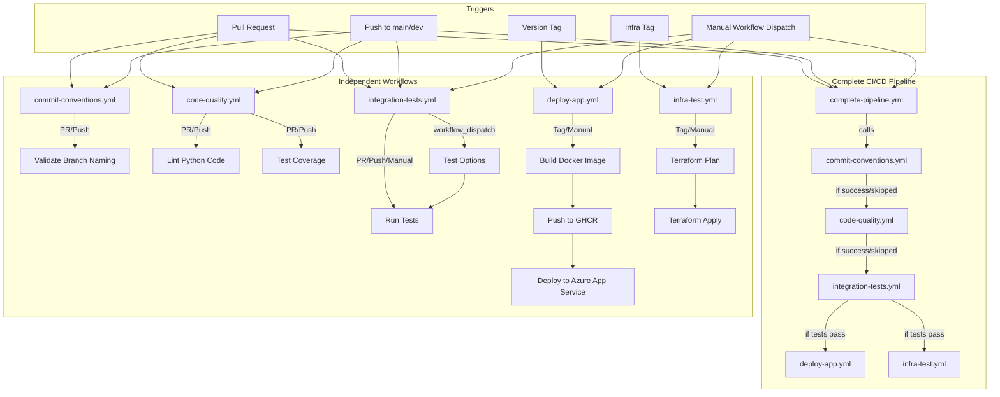
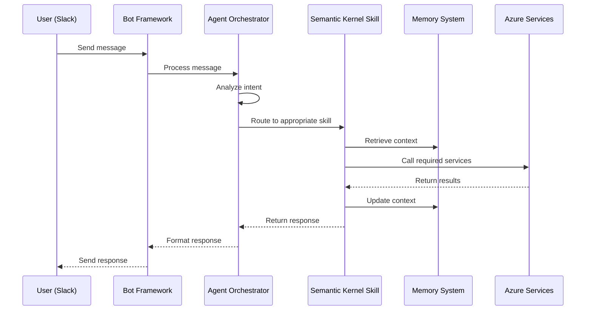

# 🧠 Konveyor: AI-Powered Knowledge Transfer Agent

> A lone engineer stands at the mouth of a shadowy codebase, torch flickering. By their side floats Konveyor—a spectral AI guide, whispering ancient commit lore, sketching system blueprints mid-air, and illuminating architectural runes hidden in legacy stone.
>
> This isn't onboarding. It's a quest.
>
> Konveyor turns tangled handovers into guided journeys—not blindfolded sprints through spaghetti.


## 🌟 The Problem: Broken Engineer Onboarding

Every organization faces the same painful reality: **software engineer onboarding is fundamentally broken**. This isn't just an inconvenience—it's a $30,000+ cost per engineer in:

- 💸 Lost productivity during 1-3 months of ramp-up
- ⏱️ Senior engineer time diverted to repetitive knowledge transfer
- 📉 Delayed project contributions and missed deadlines
- 😓 Frustration and cognitive overload for new hires

The root causes are universal:
- 📚 Scattered, outdated, or non-existent documentation
- 🧩 Knowledge silos and tribal information
- 🗺️ Overwhelming or unstructured onboarding experiences
- 🔍 Difficulty understanding complex, undocumented codebases
- 👥 Limited access to mentorship from senior engineers

## 💡 The Solution: Konveyor

Konveyor is an AI-powered knowledge transfer agent designed specifically for software engineer onboarding. Unlike generic AI assistants, Konveyor is purpose-built to understand engineering context, codebase architecture, and the unique challenges of technical onboarding.

Built on Microsoft's Semantic Kernel framework and Azure AI services, Konveyor transforms existing infrastructure into a powerful knowledge transfer agent that:

1. **Answers questions about documentation** with proper context and citations
2. **Explains code snippets** with architectural insights and design decisions
3. **Identifies knowledge gaps** and creates personalized learning paths

## 🛠️ Key Features

### 📚 Documentation Navigator
- Searches and retrieves relevant documentation with context awareness
- Preprocesses queries to understand onboarding-related questions
- Formats responses with proper source citations
- Maintains conversation context for natural follow-up questions

### 💻 Code Understanding
- Parses and explains code snippets with language detection
- Analyzes code structure and organizational patterns
- Generates clear explanations with syntax highlighting
- Connects code explanations to architectural context

### 🧩 Knowledge Gap Analyzer
- Maps questions to a taxonomy of knowledge areas
- Tracks user confidence across different domains
- Identifies potential knowledge gaps
- Suggests relevant resources for learning

### 💬 Slack Integration
- Seamless interaction through familiar chat interface
- Thread support for organized conversations
- Rich message formatting for code and technical content
- Slash commands for specialized functionality

## 🏗️ Architecture

Konveyor is built on a modern, modular architecture:

- **Microsoft Semantic Kernel** for AI orchestration and skill management
- **Azure OpenAI** for advanced language understanding and generation
- **Azure Cognitive Search** for semantic document retrieval
- **Azure Key Vault** for secure credential management
- **Slack Bot Framework** for user interaction

The system follows an agent-based architecture with specialized skills that can be invoked based on user needs. A memory system maintains conversation context and tracks user knowledge.

---
### Module Structure


```
konveyor/
├─ apps/
│  ├─ documents/       # Document ingestion, parsing, chunking
│  ├─ search/          # Semantic search and indexing
│  ├─ rag/             # RAG workflows and conversation management
│  └─ bot/             # Bot Framework and Slack integration
├─ core/
│  ├─ azure_utils/     # Azure service clients and configuration
│  ├─ conversation/    # Conversation storage and management
│  ├─ documents/       # Core document processing
│  └─ generation/      # Semantic Kernel and memory configuration
└─ skills/
   ├─ documentation_navigator/  # Documentation search and retrieval
   ├─ code_understanding/       # Code parsing and explanation
   ├─ knowledge_analyzer/       # Knowledge gap detection
   └─ common/                   # Shared skill utilities
```


Key components:
- **konveyor/apps/documents**: Handles document ingestion, parsing, chunking, and storage
- **konveyor/apps/search**: Manages semantic search, batch indexing, and search endpoints
- **konveyor/apps/rag**: Orchestrates RAG workflows and conversation management
- **konveyor/apps/bot**: Integrates with Slack and Bot Framework for chat interfaces
- **konveyor/core**: Contains shared utilities, Azure adapters, and core business logic
- **konveyor/skills**: Houses Semantic Kernel skills for specialized AI capabilities

### Agent Workflow



### CI/CD Pipeline


## 🚀 The Impact

Konveyor transforms software engineer onboarding from a fragmented, high-cost process into a streamlined, AI-augmented experience:

- ⏱️ **Reduces onboarding time by 30-50%**, saving organizations thousands of dollars per engineer
- 🧠 **Frees senior engineers from repetitive knowledge transfer**, allowing them to focus on high-value work
- 📈 **Accelerates time-to-productivity** for new hires, enabling faster project contributions
- 😌 **Reduces cognitive overload** by providing just-in-time, contextual information
- 🔄 **Enables self-service onboarding**, reducing dependency on human availability

## 🌐 Why Konveyor is Different

Unlike generic AI assistants, Konveyor is:

1. **Purpose-built for software engineering onboarding**, not a general-purpose chatbot
2. **Contextually aware** of organizational terminology, architecture, and code patterns
3. **Integrated with existing tools** through Slack, meeting engineers where they work
4. **Built on an agentic framework** with specialized tools for documentation, code, and knowledge gaps
5. **Designed for both passive and active knowledge delivery**, adapting to different learning styles

## 🔧 Getting Started

### Prerequisites

- Python 3.10+
- Azure account with appropriate services
- Slack workspace with admin privileges

### Installation

1. Clone the repository
   ```bash
   git clone https://github.com/yourusername/konveyor.git
   cd konveyor
   ```

2. Create a virtual environment
   ```bash
   python -m venv venv
   source venv/bin/activate  # On Windows: venv\Scripts\activate
   ```

3. Install dependencies
   ```bash
   pip install -r requirements/development.txt
   ```

4. Set up environment variables
   ```bash
   cp .env.example .env
   # Edit .env with your configuration
   ```

5. Run migrations
   ```bash
   python manage.py migrate
   ```

6. Start the development server
   ```bash
   python manage.py runserver
   ```

## 📸 Slack App Screenshots

### Konveyor Bot Interface
 Interface.jpeg)


## 🔮 Future Enhancements

- Persistent memory system using Azure Cognitive Search
- Multi-tenant onboarding capabilities
- Additional skills for specialized knowledge domains
- Integration with Microsoft Teams
- Analytics dashboard for knowledge gap visualization
- Automated knowledge base updates

## 🏆 The Vision

Konveyor aims to transform software engineer onboarding from a fragmented, high-cost process into a streamlined, AI-augmented experience that empowers engineers to become productive, confident contributors in record time.

This isn't just about reducing costs—it's about creating a better onboarding experience for engineers and enabling organizations to unlock the full potential of their technical talent.

---

Built with ❤️ for the Azure AI Hackathon