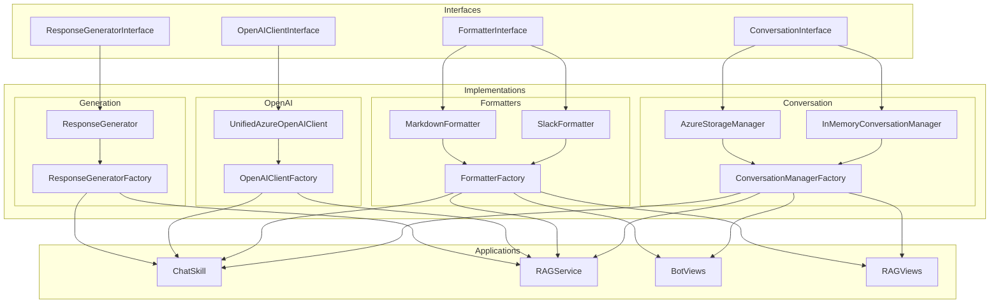
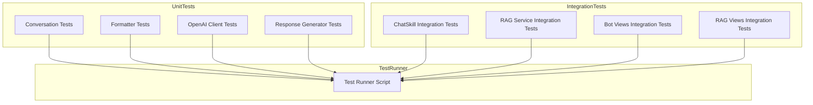
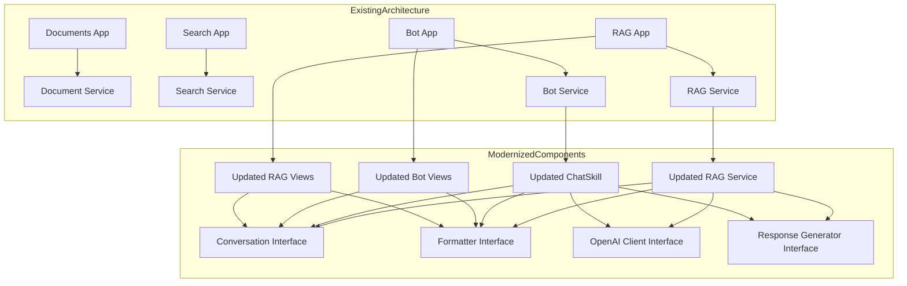

# Konveyor App Modernization Architecture

## Overview

This document describes the architecture of the modernized components in the Konveyor application. The app modernization initiative addresses redundancy in the codebase, particularly between the ChatSkill implementation and the RAG service, by creating a more maintainable, modular architecture with clear interfaces and separation of concerns.

## Core Components

The modernized architecture introduces several core components organized around well-defined interfaces:

### 1. Conversation Management

The conversation management module handles the storage and retrieval of conversation history.

**Key Components:**
- `ConversationInterface`: Interface for conversation management
  - Methods: `create_conversation`, `add_message`, `get_conversation_messages`, `get_conversation_context`, `delete_conversation`, `update_conversation_metadata`, `get_user_conversations`
  - Location: `konveyor/core/conversation/interface.py`

- `InMemoryConversationManager`: In-memory implementation for development and testing
  - Stores conversations and messages in memory
  - Useful for development, testing, and scenarios where persistence is not required
  - Location: `konveyor/core/conversation/memory.py`

- `AzureStorageManager`: Azure-based implementation for production
  - Uses Azure Cosmos DB for conversation storage
  - Uses Redis for caching
  - Location: `konveyor/core/conversation/storage.py`

- `ConversationManagerFactory`: Factory for creating conversation managers
  - Methods: `create_manager`, `get_default_storage_type`
  - Supports both in-memory and Azure storage options
  - Location: `konveyor/core/conversation/factory.py`

### 2. Message Formatting

The message formatting module handles the formatting of messages for different output formats.

**Key Components:**
- `FormatterInterface`: Interface for message formatting
  - Methods: `format_message`, `format_error`, `format_list`, `format_code`, `format_table`, `format_rich_message`, `parse_markdown`
  - Location: `konveyor/core/formatters/interface.py`

- `SlackFormatter`: Slack-specific implementation
  - Formats messages for Slack, including rich formatting with blocks
  - Supports various formatting options like code blocks, tables, and lists
  - Location: `konveyor/core/formatters/slack.py`

- `MarkdownFormatter`: Markdown implementation
  - Formats messages in Markdown format for general use
  - Can be used as a base for other platform-specific formatters
  - Location: `konveyor/core/formatters/markdown.py`

- `FormatterFactory`: Factory for creating formatters
  - Methods: `get_formatter`, `register_formatter`
  - Supports different output formats like Slack and Markdown
  - Location: `konveyor/core/formatters/factory.py`

### 3. Azure OpenAI Integration

The Azure OpenAI integration module handles the interaction with Azure OpenAI services.

**Key Components:**
- `OpenAIClientInterface`: Interface for Azure OpenAI integration
  - Methods: `generate_completion`, `generate_embedding`
  - Location: `konveyor/core/azure_utils/openai_interface.py`

- `UnifiedAzureOpenAIClient`: Adapter for existing OpenAI clients
  - Adapts both the OpenAI SDK client and the custom AzureOpenAIClient
  - Provides a consistent interface for generating completions and embeddings
  - Location: `konveyor/core/azure_utils/openai_client.py`

- `OpenAIClientFactory`: Factory for creating OpenAI clients
  - Methods: `get_client`, `register_client`
  - Supports different client types (unified, custom, SDK)
  - Location: `konveyor/core/azure_utils/openai_factory.py`

### 4. Response Generation

The response generation module handles the generation of responses using Azure OpenAI.

**Key Components:**
- `ResponseGeneratorInterface`: Interface for response generation
  - Methods: `generate_response`, `generate_with_rag`, `generate_direct`, `retrieve_context`, `get_prompt_template`, `format_prompt`
  - Location: `konveyor/core/generation/interface.py`

- `ResponseGenerator`: Implementation with RAG and direct generation support
  - Supports both RAG and direct generation approaches
  - Integrates with conversation and context services
  - Supports different prompt templates and generation strategies
  - Location: `konveyor/core/generation/generator.py`

- `ResponseGeneratorFactory`: Factory for creating response generators
  - Methods: `get_generator`, `register_generator`
  - Supports different generator types (default, RAG, chat)
  - Location: `konveyor/core/generation/factory.py`

## Updated Implementations

The modernized architecture includes updated versions of existing components that use the new core components:

### 1. ChatSkill

The updated ChatSkill uses the new core components for conversation management, message formatting, and response generation.

**Key Changes:**
- Uses `ConversationManagerFactory` to create a conversation manager
- Uses `FormatterFactory` to create a formatter
- Uses `ResponseGeneratorFactory` to create a response generator
- Maintains backward compatibility with the existing code
- Location: `konveyor/core/chat/skill_updated.py`

### 2. RAG Service

The updated RAG service uses the new core components for conversation management, message formatting, and response generation.

**Key Changes:**
- Uses `ConversationManagerFactory` to create a conversation manager
- Uses `FormatterFactory` to create a formatter
- Uses `ResponseGeneratorFactory` to create a response generator
- Maintains backward compatibility with the existing code
- Location: `konveyor/core/rag/rag_service_updated.py`

### 3. Bot Views

The updated bot views use the new core components for conversation management, message formatting, and response generation.

**Key Changes:**
- Uses `ConversationManagerFactory` to create a conversation manager
- Uses `FormatterFactory` to create a formatter
- Uses the updated ChatSkill for response generation
- Maintains backward compatibility with the existing code
- Location: `konveyor/apps/bot/views_updated.py`

### 4. RAG Views

The updated RAG views use the new core components for conversation management, message formatting, and response generation.

**Key Changes:**
- Uses `ConversationManagerFactory` to create a conversation manager
- Uses `FormatterFactory` to create a formatter
- Uses the updated RAG service for response generation
- Maintains backward compatibility with the existing code
- Location: `konveyor/apps/rag/views_updated.py`

## Testing Architecture

The modernized architecture includes comprehensive tests for all components:

**Key Components:**
- Unit tests for all core components
- Integration tests for updated implementations
- Test runner script at `tests/run_tests.py`

## Deployment Strategy

The modernized architecture includes a deployment script for replacing the original files with the updated versions:

**Key Components:**
- Script to rename updated files at `scripts/rename_updated_files.py`
- Creates backups of original files
- Renames updated files to replace originals

## Benefits of the Modernized Architecture

1. **Reduced Redundancy**: Eliminates duplicate code across ChatSkill and RAG service
2. **Improved Maintainability**: Clear interfaces and separation of concerns
3. **Enhanced Flexibility**: Support for different storage options and output formats
4. **Better Testability**: Comprehensive test coverage for all components
5. **Clearer Architecture**: Well-defined component boundaries and responsibilities

## Integration with Existing Architecture

The modernized components integrate with the existing architecture as follows:

## Conclusion

The modernized architecture provides a solid foundation for future development and expansion of the Konveyor platform. The new interfaces and components address the redundancy in the codebase and create a more maintainable, modular architecture with clear separation of concerns.
