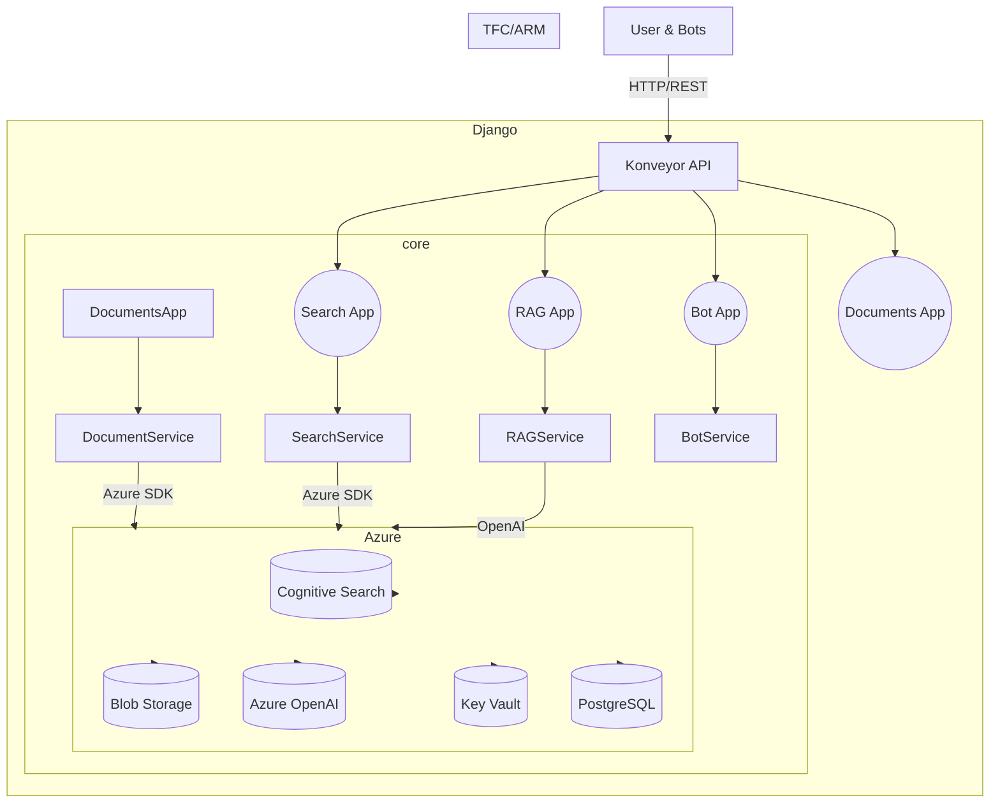

# Konveyor Architecture (v2.0)

## Table of Contents

- [Konveyor Architecture (v2.0)](#konveyor-architecture-v20)
  - [Table of Contents](#table-of-contents)
  - [1. Overview](#1-overview)
  - [2. High-Level Architecture](#2-high-level-architecture)
  - [3. Module Descriptions](#3-module-descriptions)
    - [3.1 konveyor/apps/documents {#konveyorappsdocuments}](#31-konveyorappsdocuments-konveyorappsdocuments)
    - [3.2 konveyor/apps/search {#konveyorappssearch}](#32-konveyorappssearch-konveyorappssearch)
    - [3.3 konveyor/apps/rag {#konveyorappsrag}](#33-konveyorappsrag-konveyorappsrag)
    - [3.4 konveyor/apps/bot {#konveyorappsbot}](#34-konveyorappsbot-konveyorappsbot)
    - [3.5 konveyor/core {#konveyorcore}](#35-konveyorcore-konveyorcore)
    - [3.6 Konveyor-infra {#konveyor-infra}](#36-konveyor-infra-konveyor-infra)
    - [3.7 tests {#tests}](#37-tests-tests)
  - [4. Data Flow {#data-flow}](#4-data-flow-data-flow)
  - [5. Deployment \& Infrastructure {#deployment--infrastructure}](#5-deployment--infrastructure-deployment--infrastructure)
  - [6. Security {#security}](#6-security-security)
  - [7. Future Enhancements {#future-enhancements}](#7-future-enhancements-future-enhancements)

---

## 1. Overview

Konveyor is an AI-driven knowledge discovery and onboarding platform built on Django and Azure. It aggregates documents, indexes them for vector search, and provides RAG (Retrieve–Augment–Generate) capabilities via Azure OpenAI.

Key technologies:
- Django REST Framework for APIs
- Azure OpenAI for embeddings & chat
- Azure Cognitive Search for vector store
- Azure Blob Storage for document storage
- Infrastructure-as-Code (Terraform/ARM) for provisioning

---

## 2. High-Level Architecture



---

## 3. Module Descriptions

### 3.1 konveyor/apps/documents {#konveyorappsdocuments}
Handles document ingestion, parsing (PDF, DOCX, Markdown, text), chunking, Blob upload, and indexing via Django adapter over core logic.

**Structure**:
```text
konveyor/apps/documents/
├─ apps.py                 # Django app configuration
├─ config.py               # Document settings (extensions, chunk sizes)
├─ urls.py                 # HTTP routes (health check, upload_document)
├─ views.py                # Function-based views (`index`, `upload_document`)
├─ models.py               # `Document`, `DocumentChunk` models
├─ services/
│  ├─ document_adapter.py  # `DjangoDocumentService` adapter to core
│  ├─ chunk_service.py     # Chunk processing helpers
│  └─ document_service.py  # App-layer stub redirecting to core
└─ tests/
   ├─ test_document_service.py
   ├─ conftest.py
   └─ run_tests.sh
```

**Key Components**:
- `upload_document` view: handles file uploads via `DjangoDocumentService.process_document`
- `DjangoDocumentService`: delegates parsing, chunking, and storage to core `DocumentService`
- `Document` & `DocumentChunk` models: store metadata and chunk content

### 3.2 konveyor/apps/search {#konveyorappssearch}
Manages semantic search and document indexing via REST API endpoints.

**Structure**:
```text
konveyor/apps/search/
├─ admin.py                # Django admin configuration
├─ apps.py                 # Django app configuration
├─ models.py               # `SearchDocument` model tracking indexing status
├─ urls.py                 # Endpoints (`api/query/`, `api/index-document/`, `api/reindex-all/`, `simple/`)
├─ views.py                # `QuerySearchView`, `SimpleSearchView`
├─ services/
│  ├─ indexing_service.py  # Batch indexing logic to Azure Cognitive Search
│  └─ search_service.py    # Wrapper over core `SearchService`
└─ tests/
   ├─ test_indexing_service.py
   └─ test_search_service.py
```

**Key Components**:
- `QuerySearchView` & `SimpleSearchView`: endpoints for semantic search
- `IndexingService`: batch indexing of document chunks to Cognitive Search
- `SearchService`: semantic and hybrid search logic via core service
- `SearchDocument`: Django model recording index status and metadata

### 3.3 konveyor/apps/rag {#konveyorappsrag}
Orchestrates RAG workflows using conversation management and core service.

**Structure**:
```text
konveyor/apps/rag/
├─ models.py               # `ConversationManager`, message type constants
├─ urls.py                 # Router registration for `ConversationViewSet`
├─ views.py                # `ConversationViewSet` (create, ask, history)
```

**Key Components**:
- `ConversationViewSet`: handles conversation lifecycle (`create`, `ask`, `history`)
- `ConversationManager`: persists messages via `AzureStorageManager`
- Core `RAGService`: retrieves context, formats prompts, and generates OpenAI chat responses

### 3.4 konveyor/apps/bot {#konveyorappsbot}
Handles Bot Framework and Slack integration for chat interactions.

**Structure**:
```text
konveyor/apps/bot/
├─ app.py                     # Bot entrypoint (`/api/messages`) with BotFrameworkAdapter
├─ bot.py                     # `KonveyorBot` class implementing activity logic
├─ initialize_slack.py        # Slack app initialization
├─ setup_secure_storage.py    # Secure credential storage setup
├─ services/
│  ├─ bot_settings_service.py
│  ├─ secure_credential_service.py
│  └─ slack_channel_service.py
├─ bot-template.json          # Bot Framework template definition
└─ slack_manifest.json        # Slack app manifest
```

**Key Components**:
- `ADAPTER` & `BOT` in `app.py`: configure BotFrameworkAdapter and bot handler
- Slack initializer and service modules for multi-platform support

### 3.5 konveyor/core {#konveyorcore}
Contains shared utilities, Azure adapters, and core business logic.

**Structure**:
```text
konveyor/core/
├─ azure_utils/
│  ├─ config.py        # `AzureConfig` for environment variable management
│  ├─ clients.py       # `AzureClientManager` for service clients (OpenAI, Search)
│  ├─ mixins.py        # Logging and retry mixins
│  ├─ retry.py         # Retry policy implementation
│  └─ service.py       # Base `AzureService` class
├─ azure_adapters/
│  └─ openai/
│     ├─ client.py     # Azure OpenAI adapter
│     └─ tests/        # Adapter tests
├─ conversation/
│  └─ storage.py       # `AzureStorageManager` for conversation history
├─ documents/
│  └─ document_service.py # Core document parsing and processing
├─ rag/
│  ├─ context_service.py  # Document processing & context retrieval
│  ├─ templates.py        # Prompt templates & RAGPromptManager
│  └─ rag_service.py      # Core RAG orchestration logic
└─ [no core/bot directory; bot logic resides in apps/bot]
```

**Key Classes**:
- `AzureConfig`, `AzureClientManager`, `AzureService`
- Core services: `DocumentService`, `SearchService`, `RAGService`, `ContextService`, `RAGPromptManager`

### 3.6 Konveyor-infra {#konveyor-infra}
Infrastructure-as-Code for Azure resource provisioning.

**Structure**:
```text
Konveyor-infra/
├─ backend/              # Terraform backend configs
├─ modules/              # Reusable Terraform modules
├─ environments/         # test/dev/prod configs
├─ scripts/              # deployment & helper scripts
├─ tasks/                # task definitions
├─ backend.tf            # backend configuration
├─ main.tf               # root module
├─ outputs.tf            # root outputs
├─ providers.tf          # provider definitions
├─ variables.tf          # input variables
├─ terraform             # (empty file)
├─ README.md             # infra readme
├─ .gitignore
└─ .terraform.lock.hcl
```

**Provisioned Resources**:
- Azure App Service / Functions
- Cognitive Search
- Blob Storage
- PostgreSQL
- Key Vault

### 3.7 tests {#tests}
Describes the test suite structure covering unit tests, service-level integration tests, API endpoint tests, and end-to-end tests.

**Structure**:
```text
tests/
├─ core/
│  └─ rag/
│     ├─ test_context_service.py
│     └─ test_rag_service.py
├─ services/
│  └─ rag/
│     ├─ test_context_service.py
│     ├─ test_rag_service.py
│     └─ test_rag_api.py
└─ integration/
   └─ test_rag_e2e.py
```

---

## 4. Data Flow {#data-flow}
1. **Document Ingestion**: upload → parse chunks → Blob Storage → index in Cognitive Search
2. **Query**: user query → SearchService → top-k chunks
3. **RAG**: retrieved chunks + prompt → OpenAI chat → response
4. **Bot**: external event → BotService → RAGService → reply

---

## 5. Deployment & Infrastructure {#deployment--infrastructure}
- CI: GitHub Actions (lint, tests, build)
- CD: Terraform apply → Azure resource provisioning
- Backend deploy: Azure App Service Docker container
- Bot deploy: Azure Functions

---

## 6. Security {#security}
- HTTPS enforced
- OAuth2 / JWT for API auth
- Secrets managed in Azure Key Vault
- RBAC roles in Azure for resource access

---

## 7. Future Enhancements {#future-enhancements}
- Real-time updates via WebSockets or SignalR
- Multi-tenant onboarding
- UI/UX: React SPA
- Additional document types (PPTX, CSV)
- Analytics & usage dashboards
