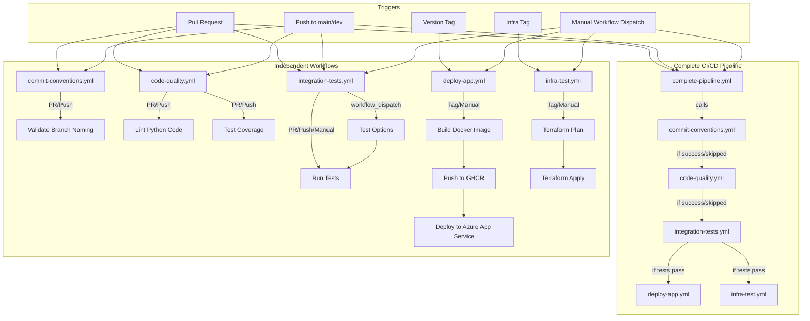
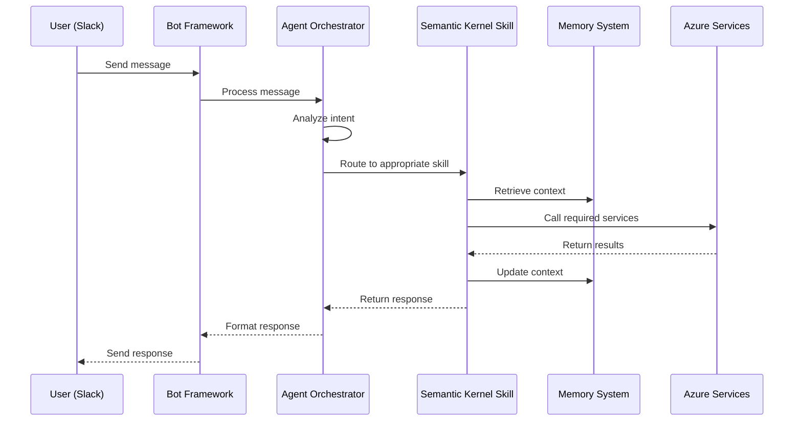

# Konveyor Architecture (v3.0)

## Table of Contents

- [Konveyor Architecture (v3.0)](#konveyor-architecture-v30)
  - [Table of Contents](#table-of-contents)
  - [1. Overview](#1-overview)
  - [2. High-Level Architecture](#2-high-level-architecture)
  - [3. Module Descriptions](#3-module-descriptions)
    - [3.1 konveyor/apps/documents](#31-konveyorappsdocuments)
    - [3.2 konveyor/apps/search](#32-konveyorappssearch)
    - [3.3 konveyor/apps/rag](#33-konveyorappsrag)
    - [3.4 konveyor/apps/bot](#34-konveyorappsbot)
    - [3.5 konveyor/core](#35-konveyorcore)
    - [3.6 konveyor/skills](#36-konveyorskills)
    - [3.7 Konveyor-infra](#37-konveyor-infra)
    - [3.8 tests](#38-tests)
  - [4. Semantic Kernel Integration](#4-semantic-kernel-integration)
    - [4.1 Skill Architecture](#41-skill-architecture)
    - [4.2 Memory System](#42-memory-system)
    - [4.3 Agent Orchestration](#43-agent-orchestration)
  - [5. Data Flow](#5-data-flow)
  - [6. Deployment & Infrastructure](#6-deployment--infrastructure)
  - [7. Security](#7-security)
  - [8. Future Enhancements](#8-future-enhancements)

---

## 1. Overview

Konveyor is an AI-driven knowledge discovery and onboarding platform built on Microsoft Semantic Kernel and Azure. It aggregates documents, indexes them for vector search, and provides intelligent agent capabilities through specialized skills that facilitate knowledge transfer and onboarding.

Key technologies:
- Microsoft Semantic Kernel for AI orchestration
- Azure OpenAI for embeddings & chat
- Azure Cognitive Search for vector store
- Azure Blob Storage for document storage
- Azure Key Vault for secure credential management
- Slack Bot Framework for user interaction
- Infrastructure-as-Code (Terraform/ARM) for provisioning

---

## 2. High-Level Architecture



---

## 3. Module Descriptions

### 3.1 konveyor/apps/documents
Handles document ingestion, parsing (PDF, DOCX, Markdown, text), chunking, Blob upload, and indexing via adapter over core logic.

**Structure**:
```text
konveyor/apps/documents/
├─ apps.py                 # App configuration
├─ config.py               # Document settings (extensions, chunk sizes)
├─ urls.py                 # HTTP routes (health check, upload_document)
├─ views.py                # Function-based views (`index`, `upload_document`)
├─ models.py               # `Document`, `DocumentChunk` models
├─ services/
│  ├─ document_adapter.py  # Document service adapter to core
│  ├─ chunk_service.py     # Chunk processing helpers
│  └─ document_service.py  # App-layer stub redirecting to core
└─ tests/
   ├─ test_document_service.py
   ├─ conftest.py
   └─ run_tests.sh
```

**Key Components**:
- `upload_document` view: handles file uploads via document processing
- Document service: delegates parsing, chunking, and storage to core
- `Document` & `DocumentChunk` models: store metadata and chunk content

### 3.2 konveyor/apps/search
Manages semantic search and document indexing via API endpoints.

**Structure**:
```text
konveyor/apps/search/
├─ models.py               # `SearchDocument` model tracking indexing status
├─ urls.py                 # Endpoints (`api/query/`, `api/index-document/`, `api/reindex-all/`, `simple/`)
├─ views.py                # `QuerySearchView`, `SimpleSearchView`
├─ services/
│  ├─ indexing_service.py  # Batch indexing logic to Azure Cognitive Search
│  └─ search_service.py    # Wrapper over core `SearchService`
└─ tests/
   ├─ test_indexing_service.py
   └─ test_search_service.py
```

**Key Components**:
- Search endpoints for semantic search
- `IndexingService`: batch indexing of document chunks to Cognitive Search
- `SearchService`: semantic and hybrid search logic via core service
- `SearchDocument`: model recording index status and metadata

### 3.3 konveyor/apps/rag
Orchestrates RAG workflows using conversation management and core service.

**Structure**:
```text
konveyor/apps/rag/
├─ models.py               # `ConversationManager`, message type constants
├─ urls.py                 # Router registration for `ConversationViewSet`
├─ views.py                # `ConversationViewSet` (create, ask, history)
```

**Key Components**:
- `ConversationViewSet`: handles conversation lifecycle (`create`, `ask`, `history`)
- `ConversationManager`: persists messages via `AzureStorageManager`
- Core `RAGService`: retrieves context, formats prompts, and generates OpenAI chat responses

### 3.4 konveyor/apps/bot
Handles Bot Framework and Slack integration for chat interactions.

**Structure**:
```text
konveyor/apps/bot/
├─ app.py                     # Bot entrypoint (`/api/messages`) with BotFrameworkAdapter
├─ bot.py                     # `KonveyorBot` class implementing activity logic
├─ initialize_slack.py        # Slack app initialization
├─ setup_secure_storage.py    # Secure credential storage setup
├─ services/
│  ├─ bot_settings_service.py
│  ├─ secure_credential_service.py
│  └─ slack_channel_service.py
├─ bot-template.json          # Bot Framework template definition
└─ slack_manifest.json        # Slack app manifest
```

**Key Components**:
- Bot Framework adapter and handler
- Slack integration for message routing
- Connection to agent orchestration layer

### 3.5 konveyor/core
Contains shared utilities, Azure adapters, and core business logic.

**Structure**:
```text
konveyor/core/
├─ azure_utils/
│  ├─ config.py        # `AzureConfig` for environment variable management
│  ├─ clients.py       # `AzureClientManager` for service clients (OpenAI, Search)
│  ├─ mixins.py        # Logging and retry mixins
│  ├─ retry.py         # Retry policy implementation
│  └─ service.py       # Base `AzureService` class
├─ azure_adapters/
│  └─ openai/
│     ├─ client.py     # Azure OpenAI adapter
│     └─ tests/        # Adapter tests
├─ conversation/
│  └─ storage.py       # `AzureStorageManager` for conversation history
├─ documents/
│  └─ document_service.py # Core document parsing and processing
├─ generation/
│  ├─ kernel.py           # Semantic Kernel initialization
│  └─ memory.py           # Memory system configuration
├─ chat/
│  ├─ orchestration.py    # Agent orchestration layer
│  └─ router.py           # Request routing to appropriate skills
└─ kernel/
   └─ config.py           # Semantic Kernel configuration
```

**Key Classes**:
- `AzureConfig`, `AzureClientManager`, `AzureService`
- Core services: `DocumentService`, `SearchService`, `KernelService`
- `AgentOrchestrator`: Routes requests to appropriate skills

### 3.6 konveyor/skills
Contains Semantic Kernel skills that provide specialized capabilities.

**Structure**:
```text
konveyor/skills/
├─ documentation_navigator/
│  ├─ __init__.py
│  ├─ skill.py              # DocumentationNavigatorSkill implementation
│  ├─ query_preprocessor.py # Onboarding query preprocessing
│  ├─ response_formatter.py # Slack-compatible markdown formatting
│  └─ tests/
│     └─ test_documentation_navigator.py
├─ code_understanding/
│  ├─ __init__.py
│  ├─ skill.py              # CodeUnderstandingSkill implementation
│  ├─ code_parser.py        # Language detection and structure analysis
│  ├─ prompt_templates.py   # Templates for code explanation
│  └─ tests/
│     └─ test_code_understanding.py
├─ knowledge_analyzer/
│  ├─ __init__.py
│  ├─ skill.py              # KnowledgeGapAnalyzerSkill implementation
│  ├─ knowledge_taxonomy.yaml # Knowledge area taxonomy definition
│  ├─ taxonomy_loader.py    # Loader for taxonomy data
│  ├─ confidence_tracker.py # User confidence scoring
│  └─ tests/
│     └─ test_knowledge_analyzer.py
└─ common/
   ├─ __init__.py
   └─ skill_base.py         # Base class for all skills
```

**Key Skills**:
- `DocumentationNavigatorSkill`: Searches and retrieves documentation with context
- `CodeUnderstandingSkill`: Parses and explains code snippets
- `KnowledgeGapAnalyzerSkill`: Identifies knowledge gaps and suggests resources

### 3.7 Konveyor-infra
Infrastructure-as-Code for Azure resource provisioning.

**Structure**:
```text
Konveyor-infra/
├─ backend/              # Terraform backend configs
├─ modules/              # Reusable Terraform modules
├─ environments/         # test/dev/prod configs
├─ scripts/              # deployment & helper scripts
├─ tasks/                # task definitions
├─ backend.tf            # backend configuration
├─ main.tf               # root module
├─ outputs.tf            # root outputs
├─ providers.tf          # provider definitions
├─ variables.tf          # input variables
├─ terraform             # (empty file)
├─ README.md             # infra readme
├─ .gitignore
└─ .terraform.lock.hcl
```

**Provisioned Resources**:
- Azure App Service
- Cognitive Search
- Blob Storage
- Key Vault
- Azure OpenAI

### 3.8 tests
Describes the test suite structure covering unit tests, service-level integration tests, API endpoint tests, and end-to-end tests.

**Structure**:
```text
tests/
├─ core/
│  ├─ kernel/
│  │  ├─ test_kernel_initialization.py
│  │  └─ test_memory_system.py
│  └─ chat/
│     ├─ test_orchestration.py
│     └─ test_router.py
├─ skills/
│  ├─ documentation_navigator/
│  │  ├─ test_query_preprocessing.py
│  │  └─ test_response_formatting.py
│  ├─ code_understanding/
│  │  ├─ test_code_parser.py
│  │  └─ test_explanation_generation.py
│  └─ knowledge_analyzer/
│     ├─ test_taxonomy_loader.py
│     └─ test_confidence_tracking.py
└─ integration/
   ├─ test_slack_integration.py
   └─ test_end_to_end.py
```

---

## 4. Semantic Kernel Integration

Konveyor leverages Microsoft's Semantic Kernel framework to create a modular, extensible AI agent system. This section details how Semantic Kernel is integrated into the architecture.

### 4.1 Skill Architecture

Semantic Kernel skills in Konveyor follow a consistent pattern:

1. **Skill Definition**: Each skill is defined as a Python class that inherits from a common base class, implementing the Semantic Kernel skill interface.

2. **Function Registration**: Skills register semantic functions that can be invoked by the kernel, with appropriate input/output schemas.

3. **Prompt Engineering**: Skills use carefully crafted prompts that guide the AI in generating appropriate responses for specific tasks.

4. **Context Management**: Skills maintain conversation context through the Semantic Kernel memory system.

Example skill registration:

```python
class DocumentationNavigatorSkill(SkillBase):
    def __init__(self, kernel, search_service):
        super().__init__(kernel)
        self.search_service = search_service

        # Register semantic functions
        self.kernel.register_semantic_function(
            skill_name="DocumentationNavigator",
            function_name="search_documentation",
            description="Searches for relevant documentation based on user query",
            prompt_template=SEARCH_PROMPT_TEMPLATE
        )
```

### 4.2 Memory System

Konveyor implements a memory system using Semantic Kernel's memory capabilities:

1. **Volatile Memory**: In-memory storage for session-based data that maintains conversation context during interactions.

2. **Conversation History**: Tracks previous interactions to provide context for follow-up questions.

3. **Knowledge Tracking**: Records user confidence scores across different knowledge areas to identify gaps.

The memory system is initialized during kernel setup:

```python
def initialize_memory(kernel):
    # Configure volatile memory store
    memory_store = VolatileMemoryStore()
    embedding_generator = kernel.get_service("text-embedding-ada-002")

    # Register memory store with the kernel
    kernel.register_memory_store(memory_store=memory_store)
    kernel.register_memory(memory=SemanticTextMemory(
        storage=memory_store,
        embeddings_generator=embedding_generator
    ))
```

### 4.3 Agent Orchestration

The agent orchestration layer routes requests to appropriate skills:

1. **Request Analysis**: Analyzes incoming messages to determine intent and required skill.

2. **Skill Selection**: Routes the request to the appropriate skill based on content analysis.

3. **Response Handling**: Processes skill responses and formats them for the target platform (e.g., Slack).

4. **Error Management**: Handles exceptions and provides graceful fallbacks.

The orchestration flow:



---

## 5. Data Flow

1. **Slack Interaction**: user message → Bot Framework → Agent Orchestrator → appropriate skill
2. **Documentation Navigation**: query → DocumentationNavigatorSkill → SearchService → Cognitive Search → formatted response
3. **Code Understanding**: code snippet → CodeUnderstandingSkill → language detection → structure analysis → explanation generation
4. **Knowledge Gap Analysis**: question → KnowledgeGapAnalyzerSkill → taxonomy mapping → confidence scoring → gap identification → resource suggestion
5. **Feedback Collection**: user reaction → feedback logging → continuous improvement

---

## 6. Deployment & Infrastructure

- CI: GitHub Actions (lint, tests, build)
- CD: Terraform apply → Azure resource provisioning
- Backend deploy: Azure App Service Docker container
- Bot deploy: Azure Functions
- Monitoring: Application Insights for telemetry

---

## 7. Security

- HTTPS enforced for all communications
- OAuth2 / JWT for API authentication
- Secrets managed in Azure Key Vault
- RBAC roles in Azure for resource access
- Secure credential storage for bot tokens

---

## 8. Future Enhancements

- Persistent memory system using Azure Cognitive Search
- Multi-tenant onboarding capabilities
- Additional skills for specialized knowledge domains
- Integration with Microsoft Teams
- Analytics dashboard for knowledge gap visualization
- Automated knowledge base updates
