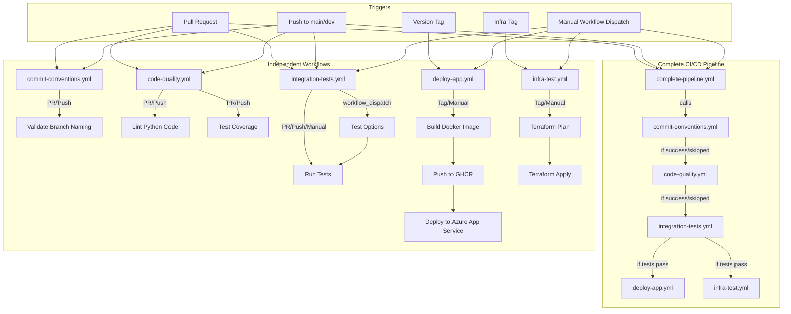

# GitHub Workflows Architecture

This document describes the architecture and relationships between the GitHub Actions workflows in the Konveyor project.

## Environment-Specific Deployments

The CI/CD pipeline supports deploying to different environments:

1. **Development (dev)**: For development and testing purposes
2. **Test (test)**: For integration testing and QA
3. **Production (prod)**: For production deployments

Each environment has its own set of resources:
- **App Service**: `konveyor-dev-app`, `konveyor-test-app`, `konveyor-prod-app`
- **Resource Groups**: `konveyor-dev-rg`, `konveyor-test-rg`, `konveyor-prod-rg`
- **Infrastructure**: Deployed from `Konveyor-infra/environments/{env}` directories

## Workflow Structure



## Workflow Dependencies

In the workflow structure:

1. **Branch Naming Check** (`commit-conventions.yml`) runs first to ensure proper branch naming.
2. **Code Quality Checks** (`code-quality.yml`) run next to ensure code meets quality standards.
3. **Integration Tests** (`integration-tests.yml`) run after code quality checks pass.
   - Tests can be run in different environments (dev, test, prod)
   - Tests can be run with mock or real services
   - Different test categories can be selected (unit, integration, real, search, document, slack)
4. **Deployment** (`deploy-app.yml`) only proceeds after integration tests pass.
   - Deploys to the specified environment (dev, test, prod)
   - Uses environment-specific resource names
5. **Infrastructure** (`infra-test.yml`) can run independently but should be completed before app deployment.
   - Deploys infrastructure to the specified environment (dev, test, prod)
   - Uses environment-specific Terraform configurations

## Implementation Status

The connected workflow structure has been implemented with the following features:

1. **Workflow Reusability**: All workflows include `workflow_call` events to be called by other workflows
2. **Job Dependencies**: Dependencies are managed using the `needs` parameter
3. **Complete Pipeline**: The `complete-pipeline.yml` workflow orchestrates the entire CI/CD process
4. **Conditional Execution**: Steps are executed conditionally based on the type of change
5. **Environment Support**: Workflows support deploying to different environments (dev, test, prod)
6. **Test Flexibility**: Integration tests support different test types, categories, and environments

## Best Practices

- **Modular Design**: Each workflow focuses on a specific aspect of the CI/CD pipeline
- **Reusable Workflows**: Workflows can be called by other workflows
- **Conditional Execution**: Only run necessary steps based on the context
- **Artifact Sharing**: Share build artifacts between workflows
- **Environment Consistency**: Use the same environment variables across workflows
- **Environment-Specific Resources**: Use environment-specific resource names
- **Caching**: Implement caching to speed up builds
- **Security**: Store secrets securely and use them consistently

## Usage Examples

### Running Tests

```bash
# Run all tests in the dev environment with mock services
python tests/run_all_tests.py --category all --env dev --mock

# Run search tests in the test environment with real services
python tests/run_all_tests.py --category search --env test --real

# Run unit tests in the prod environment
python tests/run_all_tests.py --category unit --env prod
```

### Deploying to Different Environments

The complete pipeline can be triggered manually with different environment options:

1. **Development**: Select `dev` environment for development testing
2. **Test**: Select `test` environment for QA testing
3. **Production**: Select `prod` environment for production deployment

Each deployment will use the appropriate resources for the selected environment.
