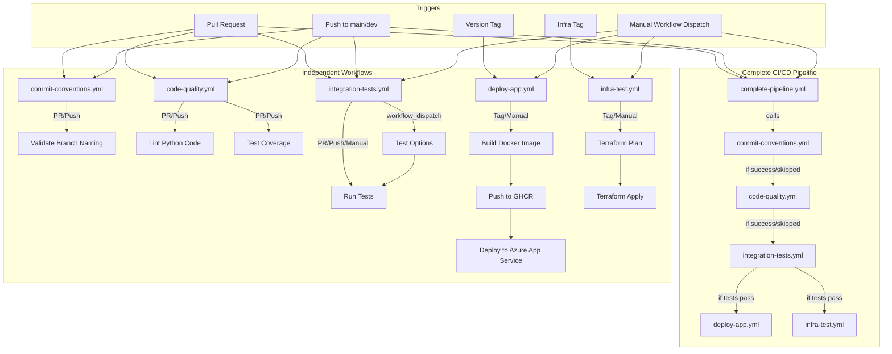
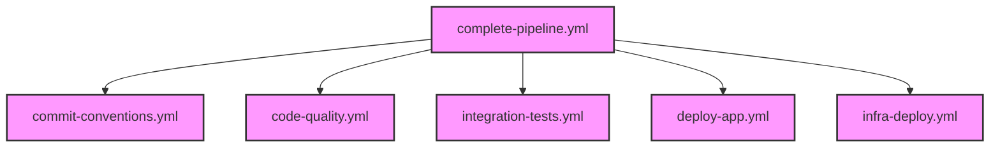
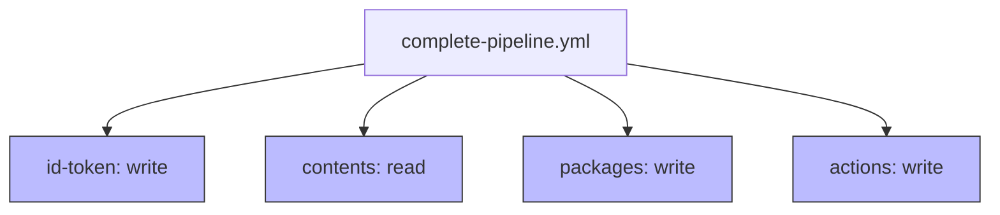
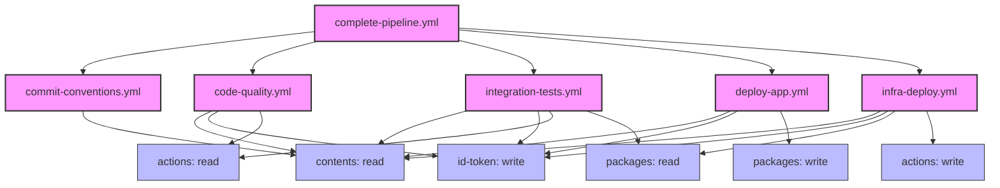

# GitHub Workflows Architecture

This document describes the architecture and relationships between the GitHub Actions workflows in the Konveyor project.

## Environment-Specific Deployments

The CI/CD pipeline supports deploying to different environments:

1. **Development (dev)**: For development and testing purposes
2. **Test (test)**: For integration testing and QA
3. **Production (prod)**: For production deployments

Each environment has its own set of resources:
- **App Service**: `konveyor-dev-app`, `konveyor-test-app`, `konveyor-prod-app`
- **Resource Groups**: `konveyor-dev-rg`, `konveyor-test-rg`, `konveyor-prod-rg`
- **Infrastructure**: Deployed from `Konveyor-infra/environments/{env}` directories

## Workflow Structure



## Workflow Dependencies

In the workflow structure:

1. **Branch Naming Check** (`commit-conventions.yml`) runs first to ensure proper branch naming.
2. **Code Quality Checks** (`code-quality.yml`) run next to ensure code meets quality standards.
3. **Integration Tests** (`integration-tests.yml`) run after code quality checks pass.
   - Tests can be run in different environments (dev, test, prod)
   - Tests can be run with mock or real services
   - Different test categories can be selected (unit, integration, real, search, document, slack)
4. **Deployment** (`deploy-app.yml`) only proceeds after integration tests pass.
   - Deploys to the specified environment (dev, test, prod)
   - Uses environment-specific resource names
5. **Infrastructure** (`infra-test.yml`) can run independently but should be completed before app deployment.
   - Deploys infrastructure to the specified environment (dev, test, prod)
   - Uses environment-specific Terraform configurations

## Implementation Status

The connected workflow structure has been implemented with the following features:

1. **Workflow Reusability**: All workflows include `workflow_call` events to be called by other workflows
2. **Job Dependencies**: Dependencies are managed using the `needs` parameter
3. **Complete Pipeline**: The `complete-pipeline.yml` workflow orchestrates the entire CI/CD process
4. **Conditional Execution**: Steps are executed conditionally based on the type of change
5. **Environment Support**: Workflows support deploying to different environments (dev, test, prod)
6. **Test Flexibility**: Integration tests support different test types, categories, and environments

## Best Practices

- **Modular Design**: Each workflow focuses on a specific aspect of the CI/CD pipeline
- **Reusable Workflows**: Workflows can be called by other workflows
- **Conditional Execution**: Only run necessary steps based on the context
- **Artifact Sharing**: Share build artifacts between workflows
- **Environment Consistency**: Use the same environment variables across workflows
- **Environment-Specific Resources**: Use environment-specific resource names
- **Caching**: Implement caching to speed up builds
- **Security**: Store secrets securely and use them consistently

## Usage Examples

### Running Tests

```bash
# Run all tests in the dev environment with mock services
python tests/run_all_tests.py --category all --env dev --mock

# Run search tests in the test environment with real services
python tests/run_all_tests.py --category search --env test --real

# Run unit tests in the prod environment
python tests/run_all_tests.py --category unit --env prod
```

### Deploying to Different Environments

The complete pipeline can be triggered manually with different environment options:

1. **Development**: Select `dev` environment for development testing
2. **Test**: Select `test` environment for QA testing
3. **Production**: Select `prod` environment for production deployment

Each deployment will use the appropriate resources for the selected environment.

## GitHub Workflow Permissions

This section provides a comprehensive analysis of the permissions required for each workflow in the Konveyor CI/CD pipeline. Understanding these permissions is crucial for ensuring that workflows run correctly without permission errors.

### Workflow Hierarchy and Permission Inheritance

When a workflow calls another workflow using the `workflow_call` trigger, the called workflow inherits permissions from the caller. However, if the called workflow requires more permissions than the caller has, the workflow will fail with a permission error.



### Permission Requirements by Workflow

#### 1. complete-pipeline.yml (Main Orchestrator)

This is the main workflow that orchestrates all other workflows. It needs to have all permissions required by any of the workflows it calls.

**Required Permissions:**
- `id-token: write` - Required for Azure authentication in multiple workflows
- `contents: read` - Required for checking out code in all workflows
- `packages: write` - Required for pushing Docker images to GitHub Container Registry
- `actions: write` - Required for creating GitHub variables in infra-deploy.yml



#### 2. commit-conventions.yml (Branch Naming Validation)

A simple workflow that validates branch naming conventions.

**Required Permissions:**
- `contents: read` - Required for checking out code

#### 3. code-quality.yml (Code Quality Checks)

Runs linting, formatting, and test coverage checks.

**Required Permissions:**
- `contents: read` - Required for checking out code
- `id-token: write` - Required for Azure login when running real tests
- `actions: read` - Required for workflow calls

#### 4. integration-tests.yml (Integration Tests)

Runs integration tests, potentially with real Azure services.

**Required Permissions:**
- `contents: read` - Required for checking out code
- `id-token: write` - Required for Azure login
- `actions: read` - Required for workflow calls
- `packages: read` - Required for pulling Docker images from GHCR

#### 5. deploy-app.yml (Application Deployment)

Deploys the application to Azure App Service.

**Required Permissions:**
- `contents: read` - Required for checking out code
- `id-token: write` - Required for Azure login
- `packages: write` - Required for pushing Docker images to GHCR

#### 6. infra-deploy.yml (Infrastructure Deployment)

Deploys infrastructure using Terraform and saves outputs to GitHub variables and secrets.

**Required Permissions:**
- `contents: read` - Required for checking out code
- `id-token: write` - Required for Azure login
- `actions: write` - Required for creating GitHub variables and secrets
- `packages: read` - Required for pulling Docker images from GHCR

### Detailed Permission Analysis by Action

This section breaks down which specific actions in each workflow require which permissions.

#### GitHub Actions Checkout (actions/checkout@v4)
- **Required Permission:** `contents: read`
- **Used in:** All workflows
- **Purpose:** To check out the repository code

#### Azure Login (azure/login@v2.1.0)
- **Required Permission:** `id-token: write`
- **Used in:** code-quality.yml, integration-tests.yml, deploy-app.yml, infra-deploy.yml
- **Purpose:** To authenticate with Azure using OIDC

#### Docker Login to GHCR (docker/login-action@v3)
- **Required Permission:** `packages: read` (for pulling), `packages: write` (for pushing)
- **Used in:** deploy-app.yml
- **Purpose:** To authenticate with GitHub Container Registry

#### GitHub Variables/Secrets Creation
- **Required Permission:** `actions: write`
- **Used in:** infra-deploy.yml
- **Purpose:** To create or update GitHub variables and secrets with infrastructure outputs

#### Workflow Call
- **Required Permission:** `actions: read` (minimum)
- **Used in:** complete-pipeline.yml
- **Purpose:** To call other workflows

### Permission Inheritance and Propagation

When the complete-pipeline.yml workflow calls other workflows, it must have at least the same level of permissions as the workflows it calls. If any called workflow requires a higher permission level, the complete-pipeline.yml must be updated to include that permission level.



### Recommended Permissions Configuration

Based on the analysis above, here is the recommended permissions configuration for each workflow:

#### complete-pipeline.yml
```yaml
permissions:
  id-token: write   # Required for Azure login
  contents: read    # Required for checkout
  packages: write   # Required for pushing to GHCR
  actions: write    # Required for creating GitHub variables
```

#### commit-conventions.yml
```yaml
permissions:
  contents: read    # Required for checkout
```

#### code-quality.yml
```yaml
permissions:
  contents: read    # Required for checkout
  id-token: write   # Required for Azure login
  actions: read     # Required for workflow calls
```

#### integration-tests.yml
```yaml
permissions:
  contents: read    # Required for checkout
  id-token: write   # Required for Azure login
  actions: read     # Required for workflow calls
  packages: read    # Required for pulling from GHCR
```

#### deploy-app.yml
```yaml
permissions:
  contents: read    # Required for checkout
  id-token: write   # Required for Azure login
  packages: write   # Required for pushing to GHCR
```

#### infra-deploy.yml
```yaml
permissions:
  contents: read    # Required for checkout
  id-token: write   # Required for Azure login
  actions: write    # Required for creating GitHub variables
  packages: read    # Required for pulling from GHCR
```

### Troubleshooting Permission Issues

If you encounter permission issues in your workflows, follow these steps:

1. Identify which workflow is failing and at which step
2. Check the error message to determine which permission is missing
3. Update the permissions in the failing workflow
4. If the workflow is called by another workflow, ensure the calling workflow also has the required permissions
5. Commit and push the changes
6. Re-run the workflow
